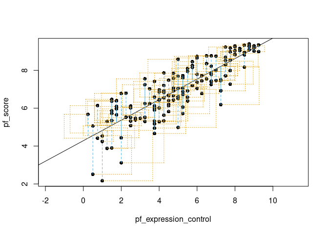
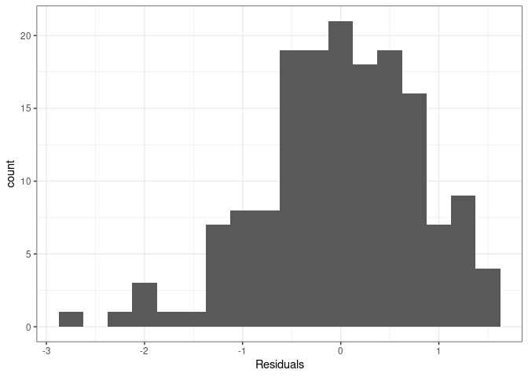

Activity 2 - Day 1
================

``` r
hfi <- readr::read_csv("https://www.openintro.org/data/csv/hfi.csv")
```

    ## Rows: 1458 Columns: 123
    ## ── Column specification ────────────────────────────────────────────────────────
    ## Delimiter: ","
    ## chr   (3): ISO_code, countries, region
    ## dbl (120): year, pf_rol_procedural, pf_rol_civil, pf_rol_criminal, pf_rol, p...
    ## 
    ## ℹ Use `spec()` to retrieve the full column specification for this data.
    ## ℹ Specify the column types or set `show_col_types = FALSE` to quiet this message.

``` r
hfi_2016 <- filter(hfi, year == 2016)
```

``` r
# plot(hfi_2016$pf_expression_control, hfi_2016$pf_score)
statsr::plot_ss(x = pf_expression_control, y = pf_score, data = hfi_2016, showSquares = TRUE)
```

<!-- -->

    ## Click two points to make a line.                                
    ## Call:
    ## lm(formula = y ~ x, data = pts)
    ## 
    ## Coefficients:
    ## (Intercept)            x  
    ##      4.2838       0.5418  
    ## 
    ## Sum of Squares:  102.213

``` r
m1 <- lm(pf_score ~ pf_expression_control, data = hfi_2016)
tidy(m1)
```

    ## # A tibble: 2 × 5
    ##   term                  estimate std.error statistic  p.value
    ##   <chr>                    <dbl>     <dbl>     <dbl>    <dbl>
    ## 1 (Intercept)              4.28     0.149       28.8 4.23e-65
    ## 2 pf_expression_control    0.542    0.0271      20.0 2.31e-45

## Day 2

### Overall model fit

``` r
hfi_2016 %>%
  summarize(cor=cor(pf_score,pf_expression_control))
```

    ## # A tibble: 1 × 1
    ##     cor
    ##   <dbl>
    ## 1 0.845

There is a strong positive correlation between `pf_score` and
`pf_expression_control`.

``` r
glance(m1)
```

    ## # A tibble: 1 × 12
    ##   r.squared adj.r.squa…¹ sigma stati…²  p.value    df logLik   AIC   BIC devia…³
    ##       <dbl>        <dbl> <dbl>   <dbl>    <dbl> <dbl>  <dbl> <dbl> <dbl>   <dbl>
    ## 1     0.714        0.712 0.799    400. 2.31e-45     1  -193.  391.  400.    102.
    ## # … with 2 more variables: df.residual <int>, nobs <int>, and abbreviated
    ## #   variable names ¹​adj.r.squared, ²​statistic, ³​deviance

The r-squared value for this model is `.71`, which means that this model
is `71%` more accurate than using the mean `pf_score` of the dataset as
our predictor.

### Create a New Model

``` r
m2 <- lm(hf_score ~ pf_expression_control, data = hfi_2016)
tidy(m2)
```

    ## # A tibble: 2 × 5
    ##   term                  estimate std.error statistic  p.value
    ##   <chr>                    <dbl>     <dbl>     <dbl>    <dbl>
    ## 1 (Intercept)              5.05     0.123       41.1 5.97e-87
    ## 2 pf_expression_control    0.368    0.0224      16.5 2.73e-36

Countries have a base mean hf\_score of `5.053` and for every unit of
`pf_expression_control`, `hf_score` will increase by `0.368`.

### Prediction and prediction errors

``` r
hfi_2016 %>% 
  ggplot(aes(x=pf_expression_control, y=pf_score)) +
  geom_smooth(method = "lm", se = FALSE) +
  geom_point() + 
  theme_bw() + 
  ggtitle('pf_score vs. pf_expression_control')
```

    ## `geom_smooth()` using formula 'y ~ x'

<!-- -->

### Model Diagnostics

``` r
m1_aug <- augment(m1)
```

``` r
ggplot(data = m1_aug, aes(x = .fitted, y = .resid)) +
  geom_point() +
  geom_hline(yintercept = 0, linetype = "dashed", color = "red") +
  xlab("Fitted values") +
  ylab("Residuals") + 
  theme_bw()
```

<!-- -->
The residuals look like they have constant variance until the higher
predicted values where variance seems to decrease.

``` r
ggplot(data = m1_aug, aes(x = .resid)) +
  geom_histogram(binwidth = 0.25) +
  xlab("Residuals") + 
  theme_bw()
```

<!-- --> Constant
variability appears to be violated because the historgram is not a
normal curve, having a left skew.

### Challange: More Practice

``` r
hfi_2016 %>%
  ggplot(aes(x = pf_expression_influence, y = pf_score)) +
  geom_point()
```

<!-- -->

``` r
m3 <- lm(pf_score ~ pf_expression_influence, data = hfi_2016)
tidy(m3)
```

    ## # A tibble: 2 × 5
    ##   term                    estimate std.error statistic  p.value
    ##   <chr>                      <dbl>     <dbl>     <dbl>    <dbl>
    ## 1 (Intercept)                4.72     0.143       33.0 2.26e-73
    ## 2 pf_expression_influence    0.459    0.0256      18.0 3.25e-40

``` r
glance(m3)
```

    ## # A tibble: 1 × 12
    ##   r.squared adj.r.squa…¹ sigma stati…²  p.value    df logLik   AIC   BIC devia…³
    ##       <dbl>        <dbl> <dbl>   <dbl>    <dbl> <dbl>  <dbl> <dbl> <dbl>   <dbl>
    ## 1     0.669        0.667 0.861    323. 3.25e-40     1  -205.  415.  424.    118.
    ## # … with 2 more variables: df.residual <int>, nobs <int>, and abbreviated
    ## #   variable names ¹​adj.r.squared, ²​statistic, ³​deviance
